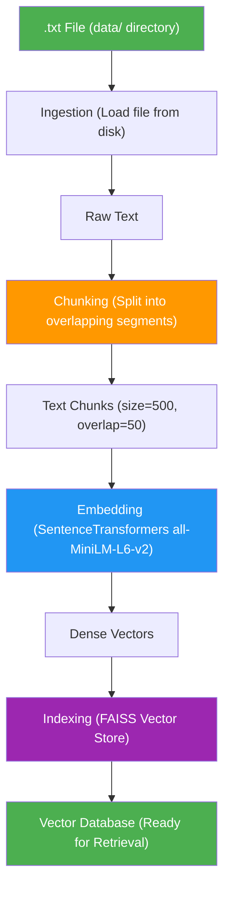
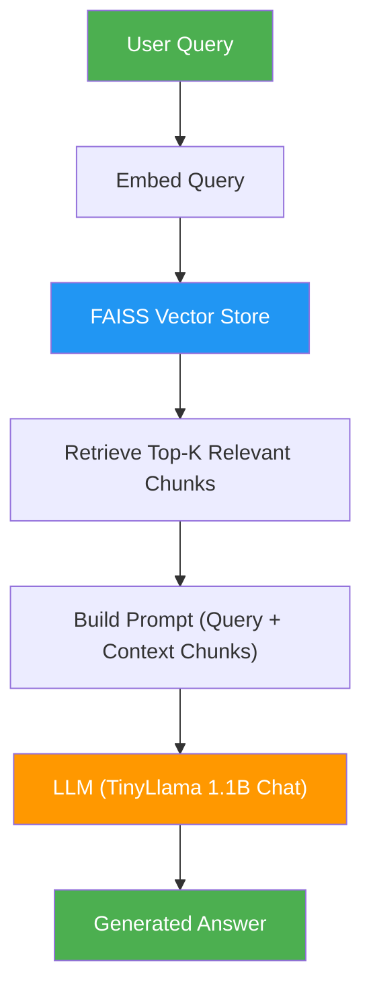

# DocuMind

**DocuMind** is a Retrieval-Augmented Generation (RAG) pipeline implemented in Python. It processes text documents through chunking, embedding, and indexing stages, then retrieves relevant context to generate accurate, grounded answers using a local language model. GPU acceleration is supported throughout the pipeline.

---

## Architecture

### Data Ingestion Flow (Text → Vector Database)

### Query → Answer Flow (Retrieval-Augmented Generation)

### Pipeline Stages

1. **Ingestion** — Load a plain text document from disk
2. **Chunking** — Split the document into overlapping segments with configurable size and overlap
3. **Embedding** — Convert each chunk into a dense vector representation using SentenceTransformers
4. **Indexing** — Store embeddings in a FAISS vector index for efficient similarity search
5. **Retrieval** — Identify the top-k most relevant chunks for a given query
6. **Generation** — Produce a grounded answer using a HuggingFace causal language model

---

## Tech Stack

| Component        | Library / Tool                                    |
|------------------|---------------------------------------------------|
| Embeddings       | [SentenceTransformers](https://www.sbert.net/) (`all-MiniLM-L6-v2`) |
| Vector Search    | [FAISS](https://github.com/facebookresearch/faiss) |
| LLM              | [TinyLlama 1.1B Chat](https://huggingface.co/TinyLlama/TinyLlama-1.1B-Chat-v1.0) via HuggingFace Transformers |
| Text Splitting   | [LangChain Text Splitters](https://python.langchain.com/) |
| GPU Acceleration | PyTorch CUDA + FAISS GPU |

---

## Configuration

All configurable parameters are defined in [`app/config.py`](app/config.py):

| Parameter             | Default                                      | Description                     |
|-----------------------|----------------------------------------------|---------------------------------|
| `DEVICE`              | `cuda` (auto-detected)                       | Compute device                  |
| `EMBEDDING_MODEL_NAME`| `all-MiniLM-L6-v2`                           | Sentence embedding model        |
| `LLM_MODEL_NAME`      | `TinyLlama/TinyLlama-1.1B-Chat-v1.0`        | Language model for generation   |
| `CHUNK_SIZE`           | `500`                                        | Characters per chunk            |
| `CHUNK_OVERLAP`        | `50`                                         | Overlap between chunks          |
| `TOP_K`                | `3`                                          | Chunks retrieved per query      |
| `LLM_MAX_NEW_TOKENS`  | `200`                                        | Maximum tokens in generated answer |
| `LLM_TEMPERATURE`     | `0.7`                                        | Sampling temperature            |

---

## Conclusion

DocuMind demonstrates how a fully local RAG pipeline can be built using open-source tools. By combining SentenceTransformers for embedding, FAISS for fast vector search, and TinyLlama for text generation, it delivers grounded, context-aware answers without relying on any external API. The modular architecture makes it straightforward to swap models, adjust chunking strategies, or scale to larger document collections. Whether used for learning, prototyping, or as a foundation for production systems, DocuMind provides a clear and extensible starting point for retrieval-augmented generation.

